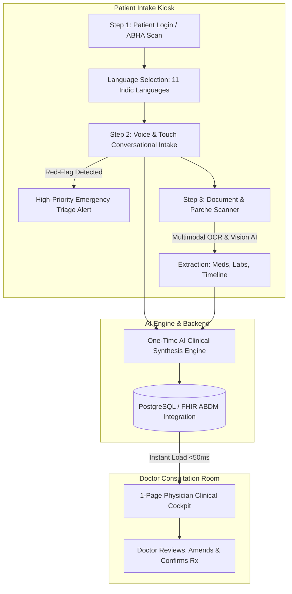

# Smart India Hackathon 2026 — Problem Statement 26047

| Field | Details |
| :--- | :--- |
| **Problem Statement ID** | **26047** |
| **Title** | **Patient Case-Taking Software** |
| **Organization** | Ministry of Ayush |
| **Department** | All India Institute of Ayurveda (AIIA) |
| **Category** | Software |
| **Theme** | MedTech / BioTech / HealthTech |
| **Reference Material** | [Additional Information & PS Document (Google Drive)](https://drive.google.com/file/d/1mQ6Qp2MKL8JXdL2kJYqV-SFqcfbxSvrd/view?usp=drive_link) |

---

## 1. Background & Context

### 1.1 The Clinical History-Taking Bottleneck in Indian Hospitals
History taking — the structured elicitation of a patient's presenting complaints, history of present illness (HPI), past medical and surgical history, drug and allergy history, family and personal history, and a review of systems — is the single most important diagnostic activity in clinical medicine. Classical teaching holds that a well-conducted history yields the correct diagnosis in **70–80% of cases**, even before examination or investigation.

Yet in India's overburdened public hospital outpatient departments (OPDs), the time available for this critical interaction has collapsed to unsustainable levels:
- **High OPD Density:** Tertiary government hospitals and apex institutions routinely register **4,000 to 10,000 OPD patients per day**.
- **Severe Time Crunch:** Average doctor-to-patient consultation time is reported between **2 and 5 minutes** — among the shortest globally (a study published in *BMJ Open, 2017*, across 67 countries placed India's average primary-care consultation at just over 2 minutes).
- **Compounded Cognitive Burden:** Within this brief window, the physician must simultaneously elicit history, physically examine the patient, review prior records, formulate a diagnosis, counsel, and prescribe. This leads to systematic under-elicitation of history, missed comorbidities, repeated questioning across visits, and diagnostic error.

#### The AYUSH & Ayurvedic Dimension
AYUSH institutions face an additional layer of complexity. Ayurvedic history taking requires comprehensive assessments:
- **Trividha, Ashtavidha, and Dashavidha Pariksha**: Evaluation of *Prakriti* (constitution), *Vikriti* (current imbalance), *Agni* (digestive capacity), *Koshtha* (bowel nature), *Sara*, *Samhanana*, *Pramana*, *Satmya*, *Sattva*, *Ahara Shakti*, *Vyayama Shakti*, and *Vaya*.
- **Nidana & Samprapti**: In-depth analysis of diet (*Ahara*), lifestyle (*Vihara*), causative factors (*Nidana*), and pathogenesis (*Samprapti*).

Capturing this depth manually within a 2–5 minute OPD window is virtually impossible, forcing practitioners to abbreviate the holistic assessment that defines personalized Ayurvedic care.

---

### 1.2 Documentation & Records Fragmentation
Compounding the time bottleneck is the severe fragmentation of patient records:
- **Physical Paper Records (*Parche*):** Patients carry handwritten prescriptions, laboratory reports, discharge summaries, and imaging films accumulated across multiple providers.
- **Consultation Disruption:** Physicians spend a significant portion of the consultation manually sorting through disordered, handwritten, multilingual paper documents.
- **The "First-Mile" Problem in ABDM:** While the Ayushman Bharat Digital Mission (ABDM) has built the national digital health backbone (ABHA IDs, Health Information Exchange, FHIR standards), there is no point-of-entry solution that digitizes, structures, and links physical documents to the patient's record *before* they enter the consultation room.

---

### 1.3 The Opportunity: AI-Powered Digital Clinical Intake Platform
Self-service kiosks have revolutionized high-throughput service industries (e.g., ATMs in banking, self-check-in at airports, self-ordering kiosks in restaurants) by offloading structured data-entry tasks from staff to the user. 

Existing hospital check-in kiosks are limited to administrative queuing. With recent advancements in:
1. **Multilingual Speech Recognition & Synthesis:** Bhashini & AI4Bharat models for Indian languages and accents.
2. **Clinical Large Language Models:** Conversational history taking structured via clinical ontologies (e.g., SOCRATES framework).
3. **Multimodal OCR & Vision AI:** Digitizing handwritten and printed medical documents.
4. **ABDM & FHIR Interoperability:** Secure linkage to Ayushman Bharat Health Accounts.

We can solve this first-mile bottleneck with an automated, multimodal **Clinical Intake Kiosk** platform.

---

## 2. Precise Problem Definition

### 2.1 The Problem Statement
> *There is currently no purpose-built, patient-facing software platform that enables patients to independently and comprehensively record their medical history — through natural spoken conversation and guided touchscreen interaction — while simultaneously digitizing physical medical documents to generate a structured, physician-ready clinical summary integrated with the hospital information system and ABDM before the patient steps into the consultation room.*

### 2.2 Why Existing Solutions Fall Short

| Solution Type | Current Limitations |
| :--- | :--- |
| **Hospital Registration Desks / Token Kiosks** | Captures only basic demographic data (name, age, token number). Zero clinical history capture or document processing. |
| **Mobile Health Apps / Tele-triage Chatbots** | Requires smartphone literacy, active internet, and pre-installation. Excludes elderly, rural, and low-literacy populations who constitute the majority of public hospital OPD visits. |
| **Nurse-Led Triage Desks** | Severely human-resource constrained. Cannot scale to 5,000+ daily OPD volumes and re-introduces manual transcription bottlenecks. |
| **Generic Document Scanners** | Produce unstructured image scans without clinical entity extraction, chronology, or ABHA integration. |

### 2.3 Specific Technical Challenges
- **Multilingual & Multi-Accent Voice Capture:** Robust speech recognition functioning in noisy hospital waiting areas across Hindi, English, and regional Indian languages.
- **Low-Literacy & Elderly Accessibility:** Intuitive, icon-driven interface with synchronized audio prompts (Bhashini TTS) and conversational voice guidance.
- **Accurate Clinical Structuring:** Converting unstructured patient speech into standardized clinical sections:
  - Chief Complaint
  - History of Present Illness (HPI) via SOCRATES
  - Past Medical / Surgical History
  - Drug & Allergy Documentation
  - Family & Personal History
  - Review of Systems (ROS)
  - Ayurvedic *Dashavidha Pariksha* parameters
- **Handwritten Document OCR & Entity Extraction:** Digitizing messy handwritten paper prescriptions (*parche*) and lab reports with entity recognition (medicines, dosages, abnormal lab ranges).
- **DPDP Act 2023 & ABDM Compliance:** Strict consent-driven workflows, localized secure processing, and automatic session teardown.

---

## 3. Solution Architecture: MediKiosk

### 3.1 Core System Modules

#### Module A: Conversational Multimodal History Engine
- **Adaptive Clinical Questioning:** Dynamically branches based on presenting complaints using clinical diagnostic ontologies (e.g., automatically probing onset, character, radiation, and relief upon hearing "chest pain").
- **Dual-Mode Input:** Every prompt is answerable by **speaking** (Bhashini ASR) or **touching** the screen, accommodating all literacy levels.
- **AYUSH Pariksha Mode:** Specialized workflow capturing *Prakriti*, *Vikriti*, *Agni*, *Koshtha*, and *Ahara-Vihara* lifestyle factors.
- **Red-Flag Emergency Detection:** Identifies critical danger symptoms (e.g., severe dyspnea, acute chest pain, neurological deficits) and triggers immediate high-priority triage alerts rather than standard OPD queueing.

#### Module B: Medical Document Digitization & Intelligence
- **Intelligent Entity Extraction:** Extracts prescribed medications, dosages, lab investigation results, and previous diagnoses from paper *parche* and reports.
- **Chronological Medical Timeline:** Automatically aligns past encounters into a coherent chronological medical history.
- **Abnormal-Value Highlighting:** Flags out-of-range lab results and alerts to contraindicated drug allergies.

#### Module C: Structured History Summary Generator
- **Physician-Ready Format:** Consolidates conversational intake and digitized documents into a high-density, 1-page clinical summary.
- **Physician Control:** Serves as an editable clinical draft that the doctor can review, amend, and approve in seconds.
- **Bilingual Capability:** Multilingual audio readout for the patient; clean, standardized English/Hindi summary for the physician.

#### Module D: Consent, Privacy & ABDM Integration
- **ABDM & FHIR Native:** Authenticates via ABHA ID and syncs structured clinical data into the national digital health ecosystem.
- **DPDP Act 2023 Compliant:** Granular, audio-explained consent mechanisms for low-literacy users.
- **Zero Data Retention on Terminal:** Temporary session data is wiped from the kiosk immediately upon submission.

---

## 4. End-to-End Patient Journey

| Stage | Action | Technology / Feature |
| :--- | :--- | :--- |
| **Step 1: Identify** | Patient scans ABHA card / enters phone number; selects language; gives audio-guided consent. | ABHA OAuth / Bhashini Language Engine |
| **Step 2: Converse** | Patient speaks or taps symptoms. AI conducts adaptive clinical intake. | Bhashini ASR & TTS, SOCRATES ontology, Red-flag alert |
| **Step 3: Scan** | Patient places paper prescriptions (*parche*) and lab reports on scanner / camera. | Gemini Vision OCR, Entity extraction, Timeline alignment |
| **Step 4: Synthesize** | System generates structured Clinical Blueprint, issues token number, and updates ABDM/HIS. | AI Synthesis Engine, PostgreSQL JSONB storage |
| **Step 5: Consult** | Physician opens patient file: the complete structured history loads in **<50ms**, leaving consultation time for physical exam and care. | 1-Page Doctor Cockpit (Zero re-generation latency) |

---

## 5. Technical Specifications & Stack

- **Frontend:** React, TypeScript, Tailwind CSS, Lucide Icons (Accessible, high-contrast, calming palette: `#3368a0`, `#66a3bf`, `#c8dfdb`, `#f2efe7`).
- **Backend:** FastAPI (Python), Uvicorn.
- **Database:** PostgreSQL (Neon Cloud) with JSONB structured clinical profiling.
- **AI & Indic Language Stack:**
  - **Bhashini (National Language Translation Mission):** Indic ASR, NMT (11 languages), and TTS audio synthesis.
  - **Multimodal AI / OCR:** Gemini Vision / Medical OCR for paper *parche* & lab reports.
- **Interoperability:** ABDM / FHIR standards compliance.
